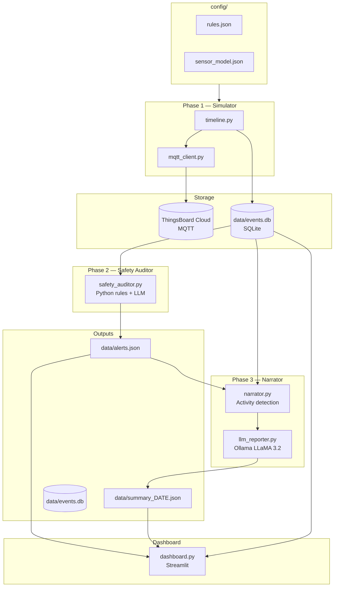

# The Invisible Caregiver
**CEID_NE576 Ubiquitous Computing** — Smart home assisted living system for elderly care using IoT sensors, MQTT, ThingsBoard Cloud, and a local AI reasoning engine.

> **Paper:** *The Invisible Caregiver — AI-assisted smart home monitoring for ageing in place*  
> University of Patras, Department of Computer Engineering & Informatics, 2026

## System Architecture



## Project Structure

```
smart-home-care-ai-assistant/
│
├── run_simulation.py       — full pipeline (Phase 1 + 2 + 3 in sequence)
├── run_simulator.py        — Phase 1 only: simulate and publish events
├── run_auditor.py          — Phase 2 only: safety audit (--simulated / --live)
├── run_narrator.py         — Phase 3 only: caregiver report + Q&A (--qa)
├── dashboard.py            — Streamlit caregiver dashboard
│
├── simulator/              — IoT sensor simulation and MQTT publishing
│   ├── mqtt_client.py      — ThingsBoard MQTT client
│   ├── timeline.py         — full-day time-series simulation engine
│   ├── scenarios.py        — instant scenario definitions (legacy)
│   └── runner.py           — legacy interactive launcher
│
├── ai/                     — AI reasoning layer
│   ├── safety_auditor.py   — hourly 1h-window hazard detection (rules + LLM)
│   ├── narrator.py         — 24h activity summary + LLM caregiver report
│   ├── llm_reporter.py     — Ollama LLM / template report generator
│   ├── storage.py          — SQLite event store + windowing helpers
│   └── sensor_model_loader.py — single source of truth for sensor definitions
│
├── config/
│   ├── rules.json          — care plan rules and activity labels
│   └── sensor_model.json   — digital twin sensor definitions (15 sensors)
│
├── data/                   — runtime outputs (gitignored)
│   ├── events.db           — SQLite sensor event log
│   ├── alerts.json         — safety alerts written by auditor
│   └── summary_YYYY-MM-DD.json — daily narrative summaries
│
├── docs/                   — academic documentation and scenario validation
└── tests/
    ├── test_mqtt.py
    ├── test_storage.py
    └── test_ai_pipeline.py
```

---

## Setup from Zero

### 1 — Prerequisites

| Requirement | Version | Notes |
|---|---|---|
| Python | 3.10+ | |
| pip | latest | `python -m pip install --upgrade pip` |
| Ollama | latest | https://ollama.com — install and keep running |
| ThingsBoard Cloud account | — | https://thingsboard.cloud — free tier is sufficient |

### 2 — Clone and install dependencies

```bash
git clone <repo-url>
cd smart-home-care-ai-assistant
pip install -r requirements.txt
```

> **What gets installed:** `paho-mqtt`, `requests`, `python-dotenv`, `ollama`, `streamlit`

### 3 — Pull the LLM model

```bash
ollama pull llama3.2
```

Verify it is available:
```bash
ollama list
```

Ollama must be **running** whenever you use Phase 3 (narrator). If it is unavailable the system falls back to a rule-based template report automatically.

### 4 — Configure ThingsBoard credentials

Create a `.env` file in the project root (never committed):

```bash
# .env — ThingsBoard Cloud credentials
TB_JWT_TOKEN=<your-jwt-token>
TB_DEVICE_ID=<your-device-uuid>
MQTT_TOKEN=<your-device-access-token>
```

How to get each value from ThingsBoard Cloud:

| Variable | Where to find it |
|---|---|
| `TB_JWT_TOKEN` | Profile → Copy JWT Token (top-right user menu) |
| `TB_DEVICE_ID` | Devices → select your device → Details tab → copy UUID |
| `MQTT_TOKEN` | Devices → select your device → Manage Credentials → Access Token |

> JWT tokens expire after **~8 hours**. Re-copy from the ThingsBoard profile menu when they do.

### 5 — (Optional) Tune system settings

Edit `config/settings.json` — no code changes needed:

```json
{
  "simulation": {
    "time_scale_seconds_per_hour": 3
  },
  "auditor": {
    "poll_interval_seconds": 60,
    "simulated_start_hour": 7,
    "simulated_end_hour": 23,
    "inactivity_threshold_hours": 3
  },
  "llm": {
    "ollama_url": "http://localhost:11434/api/generate",
    "ollama_model": "llama3.2",
    "request_timeout_seconds": 60
  }
}
```

`time_scale_seconds_per_hour: 3` — a full 24-hour day runs in ~48 real seconds.

---

## Running the System

### Full pipeline (simulate → audit → narrate)

```bash
python run_simulation.py
```

Runs all three phases in sequence and prints a summary at the end.

### Run each phase independently

```bash
# Terminal 1 — Phase 1: simulate and publish events
python run_simulator.py

# Terminal 2 — Phase 2: safety audit (replace date with today's date)
python run_auditor.py --simulated 2026-06-26

# Terminal 3 — Phase 3: generate caregiver narrative report
python run_narrator.py --date 2026-06-26

# Terminal 4 — Phase 3 + interactive Q&A
python run_narrator.py --date 2026-06-26 --qa
```

### Live auditor mode

```bash
python run_auditor.py --live    # polls every 60 s; press Ctrl+C to stop
```

### Caregiver dashboard

```bash
streamlit run dashboard.py
```

Opens at `http://localhost:8501` in your browser.

---

## Scenarios

| # | Name | Description | Alerts generated |
|---|---|---|---|
| 1 | Normal Day | Resident completes full daily routine | 0 |
| 2 | Decline Day | Missed medication (×2) + extended inactivity (×3) | 5 |
| 3 | Hazard Day | Water heater on + stove on + stove unattended + night exit | 4 |

The scenario is selected interactively when you run `run_simulator.py` or `run_simulation.py`.

---

## Tests

```bash
python tests/test_mqtt.py           # verify MQTT publish to ThingsBoard
python tests/test_storage.py        # verify event storage and windowing
python tests/test_ai_pipeline.py    # verify AI reasoning (run after simulation)
```

---

## Configuration files

| File | Purpose |
|---|---|
| `config/settings.json` | Global tuning — simulation speed, LLM URL, auditor thresholds |
| `config/rules.json` | Care plan rules (hazard detection logic and activity labels) |
| `config/sensor_model.json` | Digital twin — 15 sensor definitions with thresholds |
| `.env` | ThingsBoard credentials (never committed) |

